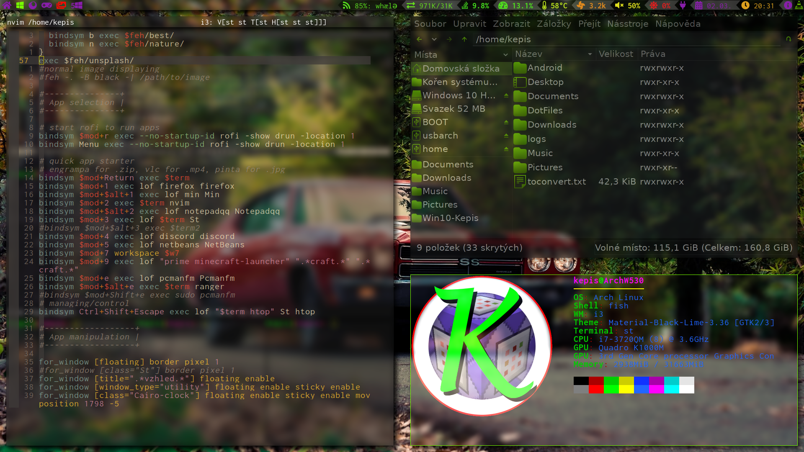
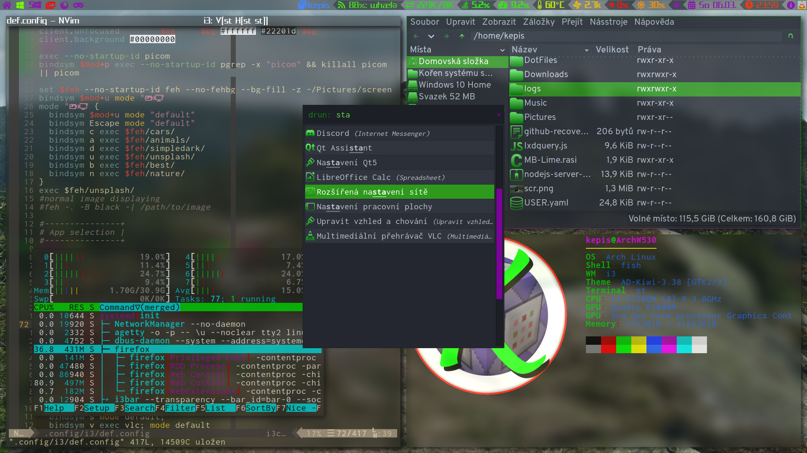
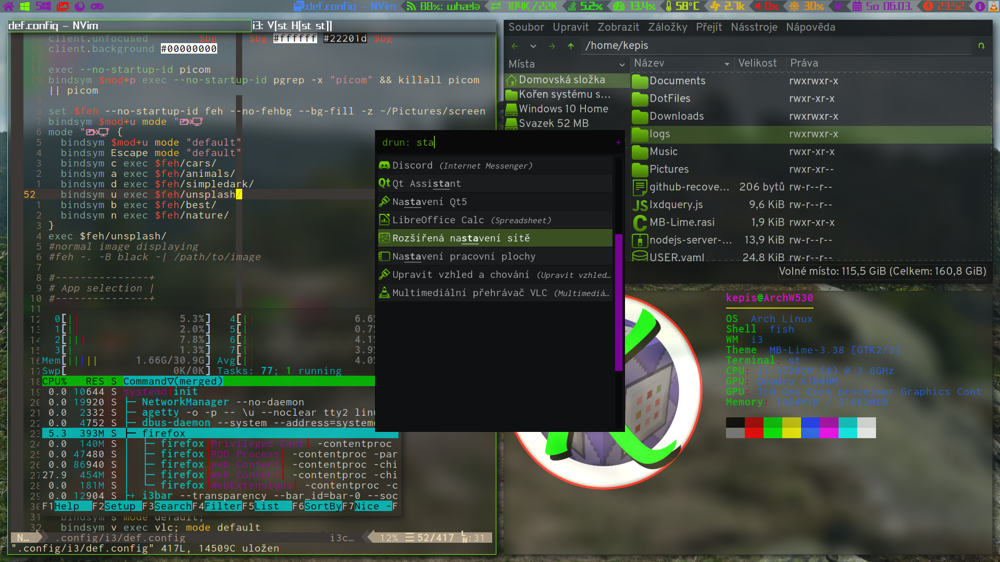

# GNU/LINUX Dotfiles

In this repository are my personal dotfiles which I use on my arch system. Plus some additional gui
applications’ configurations (vlc, pcmanfm)

# Dotfiles in this repo

-   i3
-   i3blocks
-   nvim
-   picom
-   fish
-   ranger
-   rofi
-   vlc
-   htop
-   handmade lockscreen lock icons

# Necessary programms

| NAME               | PURPOSE                                           |
|--------------------|---------------------------------------------------|
| acpi               | get information about battery                     |
| alsa-utils         | sound control                                     |
| bc                 | used for floating-point arithmetics               |
| bat                | cat with syntax highlightning                     |
| feh                | background setter and image viewer                |
| fish               | my shell of choice                                |
| fontfinder-gtk     | optional, online font view&install                |
| fzf                | fuzzy finder used in ranger and shell             |
| git                | vcs system                                        |
| gvfs-mtp           | mounting phones                                   |
| gvfs               | for pcmanfm automounting                          |
| i3-gaps            | window manager of choice                          |
| i3blocks           | statusbar                                         |
| i3lock             | lockscreen                                        |
| i3lock-fancy-rapid | blazing fast screenshot blur for i3lock           |
| i3title            | shows current app title in statusbar              |
| imagemagick        | image management library                          |
| inxi               | the best system props tool                        |
| libxft-bgra        | fixed color emojis for st                         |
| mpris-ctl          | music bg controller                               |
| neovim             | my editor of choice                               |
| nodejs             | for npm to work                                   |
| notepadqq          | linux replacement for notepad++; editor           |
| npm                | node package manager for lsp servers              |
| otf-overpass       | well-readable and looking font for UI             |
| pacman-contrib     | contains ‘checkupdates’ used in script            |
| paru               | aur packages helper                               |
| pavucontrol        | gui way to control pulse audio                    |
| pcmanfm-gtk3       | file manager                                      |
| picom-ibhagwan-git | compositor with great blur method                 |
| pynvim             | used for rnvimr ranger plugin for neovim          |
| qt5ct              | use gtk3 theme for qt                             |
| scrot              | tool for taking screenshot                        |
| st                 | [best terminal](https://github.com/JosefLitos/st) |
| ranger             | terminal file browser                             |
| rofi               | dmenu replacement                                 |
| ttf-exo2           | better UI font                                    |
| ttf-firacode       | better monospace font                             |
| ttf-font-awesome   | font with custom                                  |
| ttf-joypixels      | font with full emoji support                      |
| ttf-nova           | font of many interesting shapes                   |
| udisks2            | diskmanagement utility                            |
| ueberzug           | image displayer for ranger                        |
| xclip              | clipboard                                         |
| xdotool            | used in scripts controls X windows                |
| xf86-video-intel   | video drivers                                     |
| xorg-server        |                                                   |
| xorg-xbacklight    | clipboard                                         |
| xorg-xcursorgen    | optional, custom cursor icons                     |
| xorg-xev           | optional, for getting xorg key names              |
| xorg-xinit         |                                                   |
| xorg-xinput        | touchpad drivers                                  |

PS: Pick your fonts, I use nerd-fonts-inconsolata for more icons, but use different for normal text,
which is wasteful.

# Two dark themes I adopted

I made rofi themes based on these two themes. Material-Black is better with a darker background.

 
