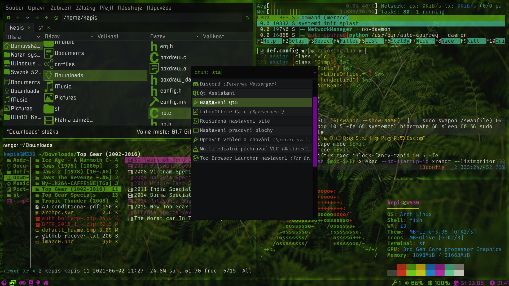

# GNU/LINUX Dotfiles

In this repository are my personal dotfiles which I use on my arch system.
I include source code for my terminal of choice: st, as well as used themes for gtk

# Dotfiles in this repo
+ i3
+ i3blocks
+ nvim
+ rofi
+ bash
+ fish
+ vlc
+ ranger
+ picom
+ termite
+ htop

# Necessary programms
| NAME                     | PURPOSE                                    |
|--------------------------|---------------------------------------------|
| acpi                     | get information about battery               |
| alsa-utils               | sound control                               |
| bc                       | used for floating-point arithmetics         |
| bat                      | cat with syntax highlightning               |
| feh                      | background and image viewer                 |
| fish                     | my shell of choice                          |
| fzf                      | fuzzy finder used in ranger and shell       |
| git                      | vcs system                                  |
| gvfs-mtp                 | mounting android phones                     |
| gvfs                     | for pcmanfm automounting                    |
| i3blocks                 | statusbar                                   |
| i3lock                   | lockscreen                                  |
| i3-gaps                  | used window manager                         |
| mpris-ctl                | music bg controller                         |
| neovim                   | my editor of choice                         |
| pavucontrol              | gui way to control pulse audio              |
| pcmanfm-gtk3             | file manager                                |
| picom                    | compositor                                  |
| qt5ct                    | use gtk3 theme for qt                       |
| scrot                    | tool for taking screenshot                  |
| st                       | terminal                                    |
| ranger                   | terminal file browse                        |
| rofi                     | dmenu replacement                           |
| termite                  | lightweight terminal with all functions     |
| ttf-dejavu               | font                                        |
| ttf-font-awesome         | font for simple emojis                      |
| ttf-inconsolata          | font                                        |
| udisks2                  | diskmanagement utility                      |
| w3m                      | image displayer                             |
| wireless-tools           | used by script for ssid                     |
| xclip                    | clipboard                                   |
| xdotool                  | used in scripts controls X windows          |
| xf86-input-synaptics     | drivers for touchpad                        |
| xf86-video-intel         | video drivers                               |
| xorg-xbacklight          | clipboard                                   |
| xorg-server              |                                             |
| xorg-xcursorgen          | for creating custom cursor icons            |
| xorg-xev                 | optional, for getting xorg key names        |
| xorg-xinit               |                                             |
| xorg-xkill               | kills x window                              |
| xorg-xprop               | information about opened windows            |
| xorg-xrandr              | used to turn off lid                        |
| xorg-xwininfo            | information about opened windows            |
| yay                      | aur helper                                  |
| imagemagick              | w3m compannion img display tool             |
